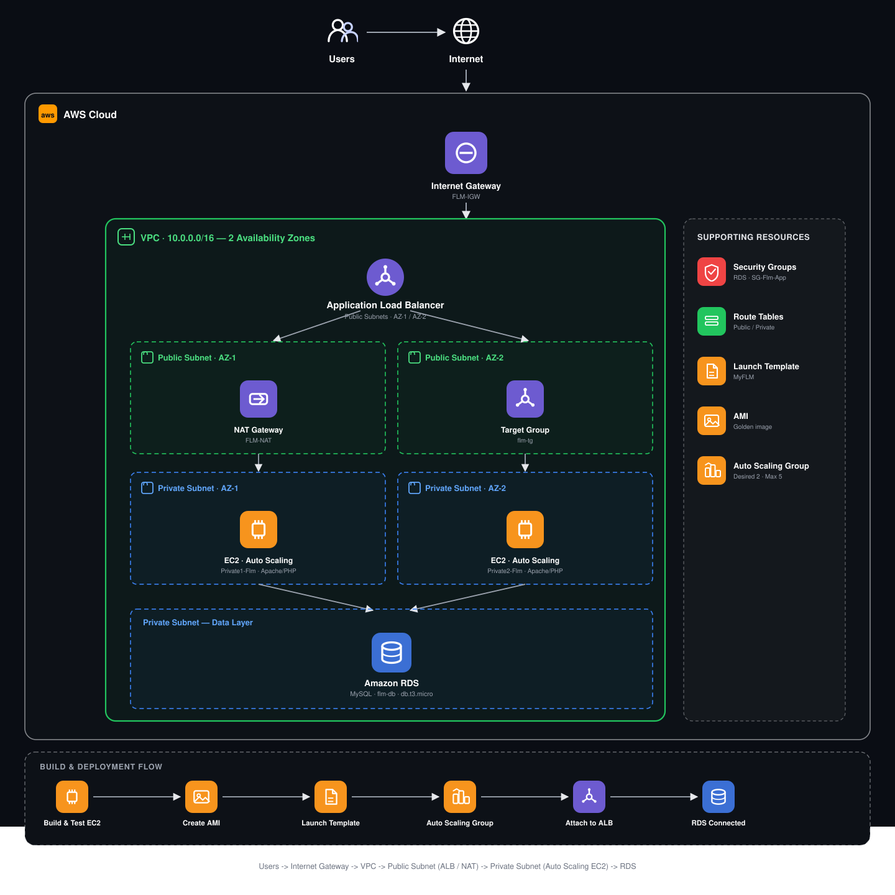
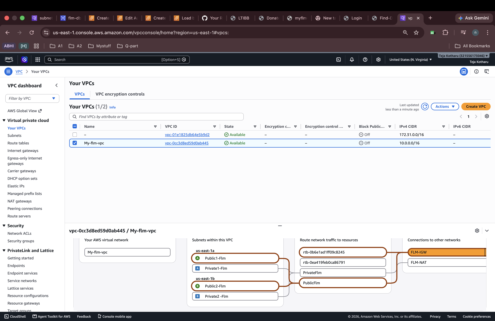
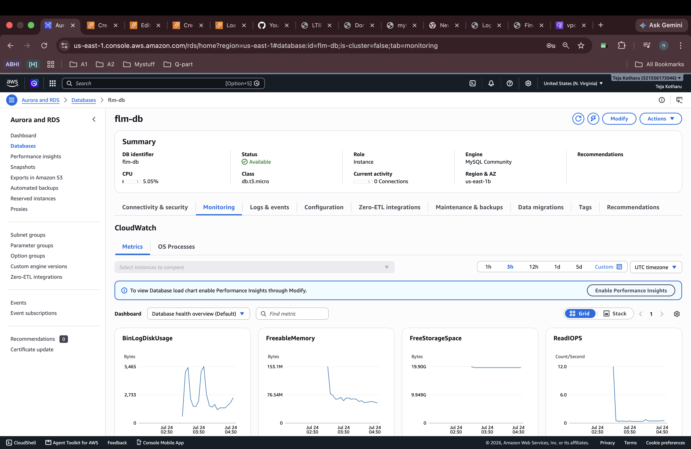
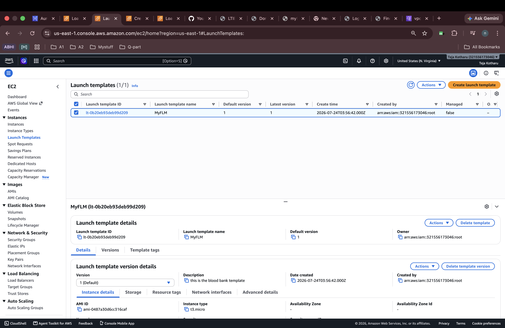
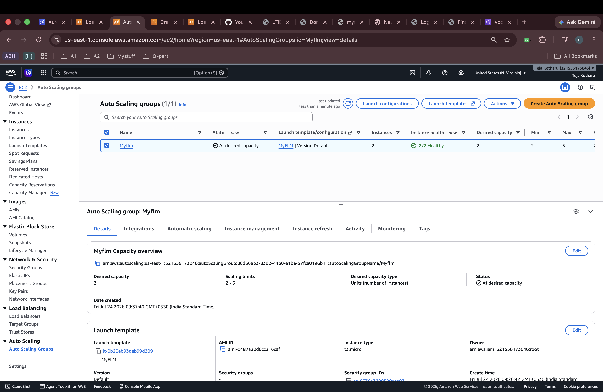
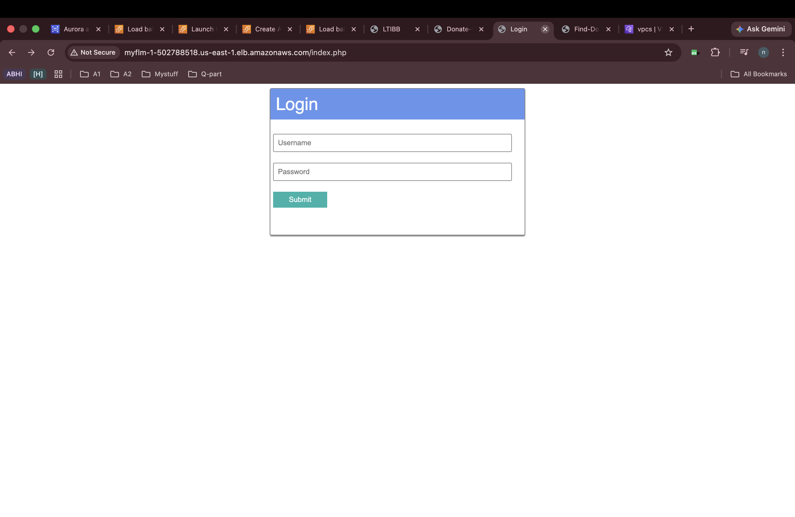
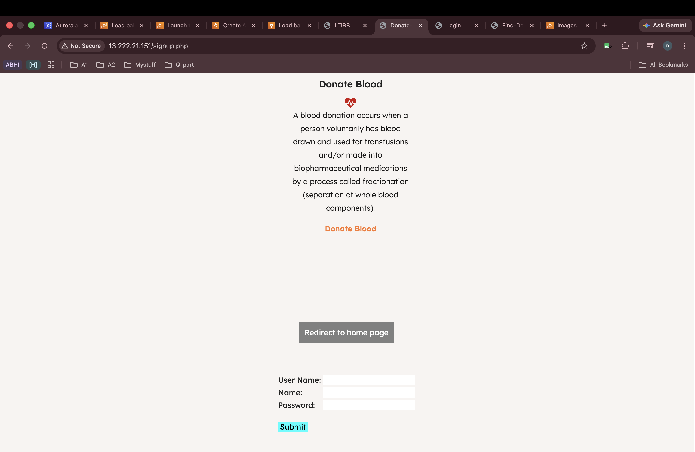
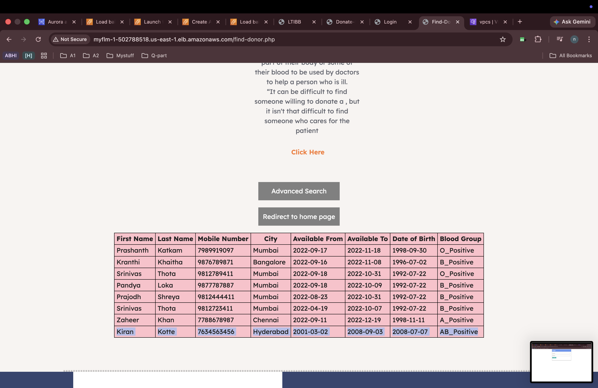
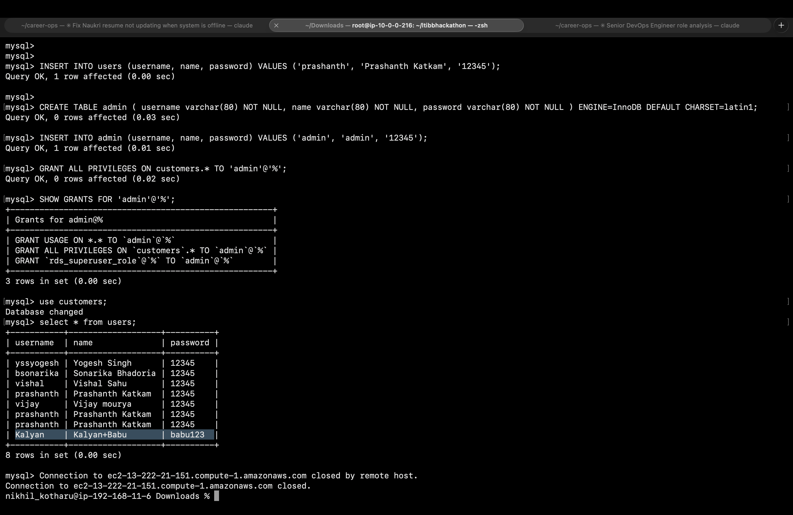

# AWS Flow — 3-Tier Architecture

> A hands-on, console-driven build of a classic **AWS 3-tier architecture** — VPC across 2 Availability Zones, a private RDS (MySQL) database tier, an Auto Scaling application tier, and a public Application Load Balancer — deployed for **MyFLM**, a PHP + MySQL blood donation portal.

[](https://aws.amazon.com)
[](https://aws.amazon.com/rds/mysql/)
[](https://httpd.apache.org)
[](https://aws.amazon.com/ec2/autoscaling/)

---

## Table of Contents

- [Overview](#overview)
- [Architecture](#architecture)
- [Repository Structure](#repository-structure)
- [Prerequisites](#prerequisites)
- [Build Flow](#build-flow)
  - [1. VPC and Subnets](#1-vpc-and-subnets)
  - [2. Internet Gateway and Public Routing](#2-internet-gateway-and-public-routing)
  - [3. NAT Gateway and Private Routing](#3-nat-gateway-and-private-routing)
  - [4. RDS (MySQL) Database Tier](#4-rds-mysql-database-tier)
  - [5. Application Server (Build and Test)](#5-application-server-build-and-test)
  - [6. AMI Creation](#6-ami-creation)
  - [7. Launch Template](#7-launch-template)
  - [8. Auto Scaling Group](#8-auto-scaling-group)
  - [9. Application Load Balancer](#9-application-load-balancer)
  - [10. Database Security Group](#10-database-security-group)
- [Application Preview](#application-preview)
- [Database Reference](#database-reference)
- [Demo Recording](#demo-recording)
- [Common Workflow](#common-workflow)

---

## Overview

This repository documents a **3-tier architecture on AWS**, built end-to-end through the AWS Console, for a PHP/MySQL blood donation web app (**MyFLM**). The three tiers:

| Tier | AWS Service | Placement |
|------|-------------|-----------|
| **Web / Presentation** | Application Load Balancer | Public subnets (2 AZs) |
| **Application** | EC2 in an Auto Scaling Group (Apache + PHP) | Private subnets (2 AZs) |
| **Database** | RDS for MySQL | Private subnet, same VPC |

The app itself is a donor-management portal — users sign up, register as blood donors, and search for donors by blood group and city. It's served from Apache/PHP instances that talk to a MySQL database on RDS.

---

## Architecture



**Request flow:** user hits the domain → **Internet Gateway** → **VPC** → **public subnet** → **Application Load Balancer** → routed to **private subnet** → **EC2 instance (Auto Scaling Group)** → **RDS**, reachable over the private VPC network since app and database sit in the same VPC. Outbound internet access for the private instances (updates, package installs) goes out through the **NAT Gateway** in the public subnet.

---

## Repository Structure

```
aws-flow-3tier/
├── README.md
└── docs/
    └── images/
        ├── vpc/
        │   └── vpc-architecture.png          # VPC, subnets, route tables, IGW/NAT
        ├── rds/
        │   └── rds-database.png               # RDS instance summary + monitoring
        ├── auto-scaling/
        │   ├── launch-template.png            # Launch template built from the AMI
        │   └── auto-scaling-group.png         # ASG desired/min/max + health
        └── outcome/
            ├── outcome-1.png … outcome-6.png   # App running behind the ALB
            └── demo-recording.mov              # Screen recording of the working app
```

---

## Prerequisites

| Requirement | Notes |
|-------------|-------|
| **AWS Account** | With permissions for VPC, EC2, RDS, ELB, Auto Scaling, IAM |
| **Key Pair** | For SSH access to the build/test EC2 instance |
| **AWS CLI / Console access** | This build was done via the Console |
| **Application code** | PHP files (`index.php`, `signup.php`, `find-donor.php`, `config.php`, etc.) + MySQL schema |

---

## Build Flow

### 1. VPC and Subnets

Create a VPC (`My-flm-vpc`, `10.0.0.0/16`) spanning **2 Availability Zones**, with one **public** and one **private** subnet per AZ:

| AZ | Public Subnet | Private Subnet |
|----|----------------|-----------------|
| `us-east-1a` | `Public1-Flm` | `Private1-Flm` |
| `us-east-1b` | `Public2-Flm` | `Private2-Flm` |

### 2. Internet Gateway and Public Routing

- Create and attach an **Internet Gateway** (`FLM-IGW`) to the VPC.
- Create a **public route table**, add a route `0.0.0.0/0 → FLM-IGW`, and associate it with both public subnets.

### 3. NAT Gateway and Private Routing

- Create a **NAT Gateway** (`FLM-NAT`) inside a public subnet (with an Elastic IP).
- Create a **private route table**, add a route `0.0.0.0/0 → FLM-NAT`, and associate it with both private subnets — this gives private instances outbound internet access (for package installs, updates) without exposing them publicly.

**VPC / subnet / route table layout:**



### 4. RDS (MySQL) Database Tier

- Launch an **RDS for MySQL** instance (`flm-db`, `db.t3.micro`) inside the **private subnet group**.
- Once available, connect from a bastion/app instance and create the schema:

```sql
CREATE DATABASE customers;
USE customers;

CREATE TABLE donors (
  id INT AUTO_INCREMENT PRIMARY KEY,
  fname VARCHAR(255) NOT NULL,
  lname VARCHAR(255) NOT NULL,
  mobileno BIGINT UNIQUE,
  city VARCHAR(255) NOT NULL,
  bfrom DATE,
  bto DATE,
  dob DATE,
  bloodgroup VARCHAR(255) NOT NULL
);

CREATE TABLE users (
  username VARCHAR(80) NOT NULL,
  name VARCHAR(80) NOT NULL,
  password VARCHAR(80) NOT NULL
) ENGINE=InnoDB DEFAULT CHARSET=latin1;

CREATE TABLE admin (
  username VARCHAR(80) NOT NULL,
  name VARCHAR(80) NOT NULL,
  password VARCHAR(80) NOT NULL
) ENGINE=InnoDB DEFAULT CHARSET=latin1;

GRANT ALL PRIVILEGES ON customers.* TO 'admin'@'%';
FLUSH PRIVILEGES;
```

Insert a handful of sample donor/user rows so the app has data to search against.

**RDS instance:**



### 5. Application Server (Build and Test)

- Launch a single EC2 instance to build and validate the app before automating it.
- Install the stack:

```bash
sudo apt-get update -y
sudo apt-get install apache2 -y
sudo apt-get install php libapache2-mod-php php-mysql php-curl php-gd php-json php-zip php-mbstring -y
sudo systemctl restart apache2
sudo systemctl enable apache2
sudo apt-get install mysql-client -y
```

- Deploy the app files to `/var/www/html/` and update every file that talks to the database with the **RDS endpoint**, database name, username, and password — at minimum: `config.php`, `signup.php`, `find-donor.php`, `donate-blood.php`, `search.php`, `index.php`, `indexadmin.php`.
- Test the app end-to-end in a browser against this single instance before moving on.

> If the app can't reach RDS, check the DB security group — it needs an **inbound MySQL/Aurora (3306)** rule that allows the app instance's security group.

### 6. AMI Creation

Once the instance is verified working (Apache running, app serving pages, DB connectivity confirmed), create an **AMI** from it. This AMI becomes the golden image every Auto Scaling instance launches from — no manual setup needed per instance.

### 7. Launch Template

Create a **Launch Template** from the AMI, specifying instance type, key pair, and the security group that allows inbound HTTP from the ALB.



### 8. Auto Scaling Group

Create an **Auto Scaling Group** from the launch template:
- Select the **private subnets** (`Private1-Flm`, `Private2-Flm`) — app instances stay off the public internet.
- Set desired/min/max capacity (e.g. desired `2`, min `2`, max `5`) to scale with load.
- Attach it to the ALB's target group (configured in the next step) for health-checked traffic distribution.



### 9. Application Load Balancer

- Create a **Target Group** targeting the **private subnets**, pointed at the app port (HTTP).
- Create an **Application Load Balancer** in the **public subnets**, listening on port 80/443, forwarding to that target group.
- Attach the ALB's target group to the Auto Scaling Group so new instances register automatically.

### 10. Database Security Group

Edit the RDS security group to allow inbound MySQL/Aurora traffic **from the Auto Scaling Group's security group**, so every app instance — current and future — can reach `flm-db` regardless of which AZ it launches in.

---

## Application Preview

The app is served through the ALB's DNS name, routed to whichever healthy private instance the ASG has running.

| Page | Description |
|------|-------------|
| **Login** (`index.php`) | User/admin sign-in |
| **Donate Blood** (`signup.php`) | Donor registration form |
| **Find Donor** (`find-donor.php`) | Search donors by blood group / city |





---

## Database Reference

Useful commands while wiring the app to RDS:

```bash
# Connect to the RDS endpoint
mysql -h <rds-endpoint> -u admin -p

# Verify data
USE customers;
SELECT * FROM users;
SHOW COLUMNS FROM donors;
```

> Whenever the database or table name changes, update it everywhere the PHP code references it — `config.php`, `index.php`, `indexadmin.php`, `signup.php`, `find-donor.php`, `search.php`.

**Live verification against RDS** — creating the `admin` table, granting privileges, and confirming the seeded rows come back from `customers.users`:



---

## Demo Recording

A full walkthrough of the working stack — VPC → ALB → ASG → RDS — is included at [`docs/images/outcome/demo-recording.mov`](docs/images/outcome/demo-recording.mov).

---

## Common Workflow

```
1. Create VPC with public + private subnets across 2 AZs
        │
        ▼
2. Attach Internet Gateway → route public subnets to it
        │
        ▼
3. Create NAT Gateway → route private subnets to it
        │
        ▼
4. Launch RDS (MySQL) in the private subnet group → create schema + seed data
        │
        ▼
5. Build + test one EC2 instance → point app config at the RDS endpoint
        │
        ▼
6. Create an AMI from the verified instance
        │
        ▼
7. Create a Launch Template from the AMI
        │
        ▼
8. Create an Auto Scaling Group (private subnets, min/max capacity)
        │
        ▼
9. Create ALB + Target Group (public subnets in, private subnets out) → attach to ASG
        │
        ▼
10. Update RDS security group to allow the ASG's security group
        │
        ▼
11. Hit the ALB DNS name → traffic flows IGW → ALB → private EC2 → RDS
```

---

<div align="center">
  <sub>AWS <strong>3-tier architecture</strong> reference build — VPC, RDS, Auto Scaling, and ALB, wired together for the MyFLM blood donation app.</sub>
</div>
